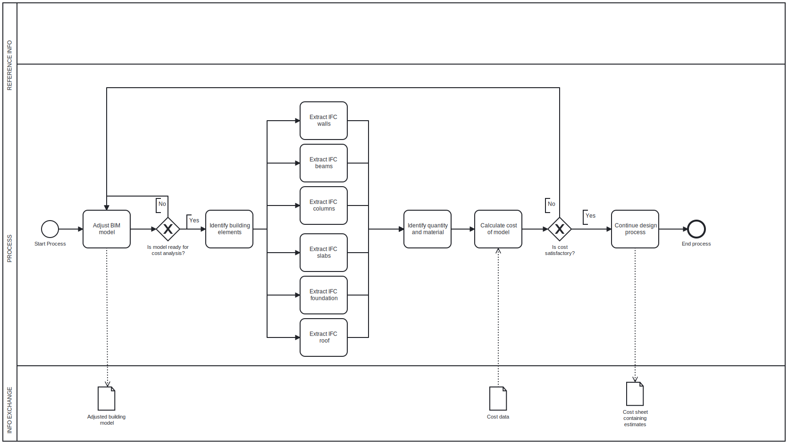

1. Goal
- To give a cost estimate of the main structural elements of a project at an early design stage. 

2. Model use (BIM uses)
* Gather - Quantify
* Analyze - forecast

3. Update BPMN diagram
- The updatet diagram should be shown under.

4. Description of the process of your tool / workflow
- The tool will identify which structural elements are present in the BIM-model and then extract the material the element consists of and the quantity of this element present in the model. After identifying the quantities and materials used, the cost for the building will be calculated using cost data containing estimated projection, material and execution costs. If the resulting cost proves satisfactory considering budgets and expectations, the project will continue its design process. If the resulting cost does not prove satisfactory, the building will need to be modified and the process starts over.

5. Information Exchange
- See Exchange_information.xlsx

6. IFC
- The data we need to gather from the IFC are the materials and dimensions (volume, area, width, length and thickness) of 

* IFCbeams
* IFCcolumns
* IFCwalls
* IFCslabs

inlcuding the foundation, roof and stairs. The area of windows and doors are important to calculate the extrusions from the walls and more precicely determine the area of the walls. Other extrusions in the wall such as installations from ventilation are neglible, if they are not already taken into consideration in the IFCwall properties. Additionally we need the cost of the materials to calculate an estimated cost of the project.  

9. Delivery
- The tool/workflow uses python code to extract the neccecary information from an IFC model and from the material cost document provided by MOLIO. The estimated cost can then be calculated manually or with an external function. 

10. Delivery
- The tool/workflow is made by: 
* Extracting quantities and materials of the main structual elements
* Extracting cost data for each element
* Produce a totalcost estimate of the structural parts of the project.
